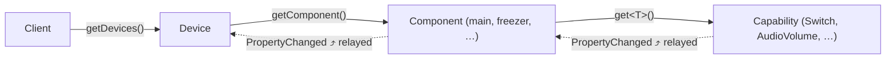

# 📚 smartthings4cpp documentation

Welcome! This is the entry point of the smartthings4cpp documentation. If you
are new, read the guides in order — they build on each other. If you are
looking for something specific, jump straight in from the tables below.

---

## The guides

| # | Guide | Read it when… |
|---|---|---|
| 1 | [Getting started](getting-started.md) | You want to build the library and run your first program |
| 2 | [Authentication](authentication.md) | You need a token — OAuth (recommended) or a PAT (quick but short-lived) |
| 3 | [Devices & capabilities](device-model.md) | You want to understand the object model and control devices |
| 4 | [Live updates](live-updates.md) | You want to *react* to device state changes — polling or real push, with a full ngrok walkthrough |
| 5 | [Webhook security](webhook-security.md) | You want to know how inbound webhooks are verified (or customize it) |
| 6 | [Extending the library](extending.md) | The embedded defaults don't fit — bring your own server, storage or crypto |
| 7 | [Capability reference](capabilities.md) | You need the full list of the 143 typed capability classes |
| 8 | [Examples tour](examples.md) | You learn best from runnable code |
| 9 | [Troubleshooting & FAQ](troubleshooting.md) | Something doesn't work |

---

## Choosing your path

The single most important decision is **how you authenticate**, because it
determines how live updates reach you:

| | 🔑 Personal Access Token | 🌐 OAuth-In App (recommended) |
|---|---|---|
| Setup effort | ~1 minute | ~15 minutes, once |
| Token lifetime | **24 hours**, not renewable | Refreshed automatically, forever |
| Live updates | Background polling (automatic) | **Real push** from the cloud |
| Needs a public URL | No | Yes (a tunnel like ngrok is fine) |
| Good for | Quick experiments, scripts | Anything that runs more than a day |

Both paths end at the exact same API: the same `Client`, the same `Device`
objects, the same `PropertyChanged` events. You can prototype with a PAT today
and switch to OAuth later without touching your device code.
[Authentication](authentication.md) covers both in depth.

---

## The object model in one diagram



- **`Client`** — the entry point. Authenticates, discovers, polls or receives
  push events. One per SmartThings account.
- **`Device`** — one physical (or virtual) device: metadata + components.
- **`Component`** — a named group of capabilities (`"main"` for most devices;
  appliances add more, e.g. a fridge's `"freezer"` and `"cooler"`).
- **`Capability`** — one unit of function: attributes you can read (reactive,
  typed) and commands you can send. 143 typed classes, plus a generic fallback.

Every level is a reactive `ObservableObject`, and `PropertyChanged` is relayed
upward — subscribe once on the `Device` and you observe every capability on it.
Details in [Devices & capabilities](device-model.md).

---

## Key types cheat sheet

| Type | Header | Role |
|---|---|---|
| `Client` | `client.h` | Auth, discovery, commands, polling, push |
| `Device` | `device.h` | A device: metadata properties + components |
| `Component` | `component.h` | Owns capabilities; relays their events |
| `Capability` | `capability.h` | Base of all typed capabilities |
| `standard::Switch`, … | `capabilities/…` | Typed capabilities ([reference](capabilities.md)) |
| `Result<T>` / `ErrorCode` | `types.h` | Error handling without exceptions |
| `oauth2::OAuth2Config` | `oauth2/oauth2_types.h` | Your OAuth-In App's identity |
| `oauth2::OAuth2Authenticator` | `oauth2/oauth2_authenticator.h` | The manual OAuth flow (protocol only) |
| `IHttpServer` | `http_server.h` | Inbound HTTP abstraction (embedded default provided) |
| `IStorageProvider` | `storage.h` | Key/value persistence (keychain + file defaults) |
| `IWebhookSignatureVerifier` | `webhook_signature.h` | Webhook HTTP-Signature verification |

One include gives you everything:

```cpp
#include <smartthings4cpp/smartthings4cpp.h>
```

---

<div align="center">

**Next:** [Getting started →](getting-started.md)

</div>
