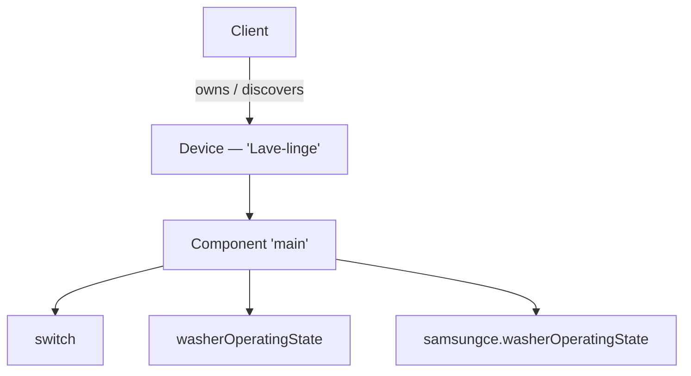

[📚 Documentation](README.md) › **Devices & capabilities**

# Devices & capabilities

How SmartThings models the world, how smartthings4cpp maps it to C++, and how
you read state, send commands, and handle errors.

- [The model](#the-model)
- [Discovering devices](#discovering-devices)
- [Locations and rooms](#locations-and-rooms)
- [Typed capabilities](#typed-capabilities)
- [Reading state](#reading-state)
- [Reacting to changes](#reacting-to-changes)
- [Sending commands](#sending-commands)
- [Unknown capabilities](#unknown-capabilities)
- [Raw escape hatches](#raw-escape-hatches)
- [Error handling](#error-handling)
- [Lifetime & threading rules](#lifetime--threading-rules)

---

## The model

SmartThings describes every device as a tree:



- A **`Device`** carries metadata (label, manufacturer, type, location, room)
  and one or more components.
- A **`Component`** is a named group of capabilities. Simple devices have just
  `"main"`; appliances add more (a fridge exposes `"freezer"`, `"cooler"`, …).
- A **`Capability`** is one unit of function — its **attributes** are state you
  read, its **commands** are actions you send.

All three levels derive from `ReactiveLitepp::ObservableObject`: state is
exposed as reactive properties (`.Get()` to read) and every change fires
`PropertyChanged`.

## Discovering devices

```cpp
Client client(token);

std::vector<std::shared_ptr<Device>> devices = client.getDevices(); // all, paginated
std::shared_ptr<Device> one = client.getDevice("device-uuid");      // or by id
```

`getDevices()` walks the paginated `GET /v1/devices` endpoint for you. Device
metadata is available immediately:

```cpp
device->Label.Get();            // "Living Room Lamp" (user label, falls back to name)
device->Id.Get();               // the deviceId UUID
device->Type.Get();             // "ZIGBEE", "ZWAVE", "OCF", "VIRTUAL", ...
device->ManufacturerName.Get(); // "Samsung Electronics", ...
device->LocationId.Get();       // resolve via getLocations()
device->RoomId.Get();           // resolve via getRooms(locationId)
```

> [!NOTE]
> Devices are **not identity-cached**: two `getDevice("x")` calls return two
> independent `Device` objects. That is fine — the `Client` still fetches
> status for the underlying device only once per polling cycle and applies it
> to every live object, and push events fan out to all of them.

## Locations and rooms

```cpp
for (const Location& loc : client.getLocations()) {
    std::cout << loc.name << " (" << loc.countryCode << ")\n";
    for (const Room& room : client.getRooms(loc.locationId)) {
        std::cout << "  - " << room.name << "\n";
    }
}
```

Match `device->LocationId.Get()` / `device->RoomId.Get()` against these to
print human-friendly placement, as the `device_listing` example does.

## Typed capabilities

Every capability your devices expose has a dedicated class with typed attribute
getters and command methods — 143 of them, generated from the live API schemas
(see the [capability reference](capabilities.md) for the full list):

- **Standard** capabilities live in `smartthings4cpp::standard`
  (`Switch`, `SwitchLevel`, `AudioVolume`, `ContactSensor`, `Battery`, …).
- **Samsung-proprietary** capabilities live in a namespace per vendor prefix:
  `samsungce::`, `samsungvd::`, `custom::`, `sec::`, `hca::`, `samsungim::`.

Look them up by type — the template matches on the class's `CAPABILITY_ID` and
down-casts safely:

```cpp
using namespace smartthings4cpp::standard;

if (auto* sw = device->getCapability<Switch>()) {          // "main" component
    sw->on();
}
if (auto* vol = device->getCapability<AudioVolume>()) {
    int v = vol->Volume.Get();
}
if (auto* pantry = device->getCapability<samsungce::FridgePantryMode>("pantry-01")) {
    // proprietary capability on a non-"main" component
}
```

Or check and enumerate without fetching:

```cpp
device->hasCapability<Switch>();          // by type
device->hasCapability("switch");          // by id, any component
device->getCapabilityIds();               // flattened, de-duplicated id list
```

## Reading state

Attribute getters read **cached** state — no network call per `.Get()`. The
cache is filled:

1. **Automatically on first access** — the first `getComponent()` /
   `getCapability()` call transparently fetches the device's full status, so a
   typed getter never observes empty pre-discovery state;
2. **Continuously** — by [background polling or push events](live-updates.md);
3. **On demand** — `device->refreshStatus()` re-fetches everything, and
   `capability->refreshStatus()` re-fetches one capability.

```cpp
auto* temp = device->getCapability<TemperatureMeasurement>();
double degrees = temp->Temperature.Get();        // cached, instant
device->refreshStatus();                         // force a re-fetch now
```

## Reacting to changes

`PropertyChanged` is relayed up the tree — a capability's event fires its
component's, which fires the device's. Subscribe at whichever level suits you;
the `sender` is always the **capability that actually changed**:

```cpp
auto sub = device->PropertyChanged.SubscribeScoped(
    [](ObservableObject& sender, PropertyChangedArgs args) {
        auto& cap = static_cast<Capability&>(sender);
        std::cout << cap.componentId() << "/" << cap.capabilityId()
                  << ": " << args.PropertyName() << " changed\n";
        // Navigate back up if needed:
        // cap.component()          -> owning Component*
        // cap.component()->device  -> owning Device*
    });
```

`SubscribeScoped` returns a `ScopedSubscription` that unsubscribes when it goes
out of scope — keep it alive as long as you want the callback. Events fire only
when a value **actually changes**, so a poll that returns identical state is
silent. Where updates come from (and which thread fires the event) is the
subject of [Live updates](live-updates.md).

## Sending commands

Typed command methods POST real commands and return a `Result<void>`:

```cpp
if (auto* sw = device->getCapability<Switch>()) {
    Result<void> r = sw->on();
    if (!r) std::cerr << "command failed: " << r.error_message << "\n";
}
if (auto* vol = device->getCapability<AudioVolume>()) {
    vol->setVolume(20);
}
```

After a successful command the library optimistically updates the local cached
attribute, so your getters (and `PropertyChanged`) reflect the new value
immediately instead of waiting a full status round-trip.

Discover what a capability can do at runtime with `commandNames()`:

```cpp
for (const auto& name : capability->commandNames()) std::cout << name << "\n";
```

## Unknown capabilities

Any capability id without a typed class (a brand-new Samsung addition, a
third-party custom capability, …) falls back to `UnknownCapability` — you still
get its raw status and it still participates in the reactive relay:

```cpp
if (Capability* cap = device->getCapability("some.vendorCapability")) {
    std::cout << cap->statusJson().dump(2) << "\n";  // raw attributes
}
```

Want it typed? [Regenerate the capability classes](capabilities.md#regenerating)
— the generator promotes anything it finds a schema for.

## Raw escape hatches

Everything typed sits on public, JSON-level primitives you can always drop to:

```cpp
nlohmann::json full = client.getDeviceStatus(deviceId);                // all components
nlohmann::json one  = client.getCapabilityStatus(deviceId, "main", "switch");

nlohmann::json body = buildCommandsBody("main", "switch", "on", nlohmann::json::array());
client.executeCommands(deviceId, body);                                // raw POST
```

`buildCommandsBody()` is pure (no I/O), so you can unit-test the payloads you
build.

## Error handling

Operations that can fail return `Result<T>` — no exceptions on the normal API
path:

```cpp
Result<void> r = sw->on();
if (!r) {                       // operator bool == isSuccess()
    switch (r.error) {
        case ErrorCode::AuthenticationFailed: /* token dead */ break;
        case ErrorCode::RateLimited:          /* back off   */ break;
        default: std::cerr << r.error_message << "\n";
    }
}
```

| `ErrorCode` | Meaning |
|---|---|
| `Success` | All good (`isSuccess() == true`) |
| `NetworkError` | Transport-level failure (DNS, TLS, timeout, …) |
| `AuthenticationRequired` | No token configured |
| `AuthenticationFailed` | Token rejected (401/403) — expired PAT, missing scope |
| `InvalidRequest` / `InvalidParameter` | The request was malformed or refused |
| `ResourceNotFound` | Unknown device/subscription id (404) |
| `Conflict` | e.g. duplicate subscription (409) |
| `RateLimited` | Too many requests (429) — see [rate limits](live-updates.md#rate-limits) |
| `ApiError` | Other server-side error (5xx) |
| `TimeoutError` | `waitForAuthentication()` expired |
| `UnknownError` | Anything else |

Collection getters (`getDevices()`, `getLocations()`, …) return empty
containers on failure rather than a `Result` — call
`client.validateAuthentication()` first when you need to distinguish "empty
account" from "bad token".

A small exception hierarchy (`SmartThingsException` and friends, in
`exceptions.h`) exists for contexts where throwing fits better, but the library
itself communicates failures through `Result`.

## Lifetime & threading rules

Three rules keep everything safe:

1. **Keep the `Client` alive** as long as any `Device` obtained from it — and
   don't move or copy it (it owns a background thread; park it behind a
   `std::unique_ptr<Client>` if you need heap storage).
2. **`Device`, `Component` and `Capability` pointers are non-owning views**
   into the `Device` you hold a `shared_ptr` to. They stay valid exactly as
   long as that `shared_ptr` lives.
3. **`PropertyChanged` fires on the update thread** — the polling thread in
   polling mode, the embedded server's thread in OAuth mode. Attribute storage
   is not synchronized against concurrent access, so if you read properties
   from another thread (or touch thread-affine state like a GUI), marshal or
   lock yourself.

---

<div align="center">

[← Authentication](authentication.md) · **Next:** [Live updates →](live-updates.md)

</div>
