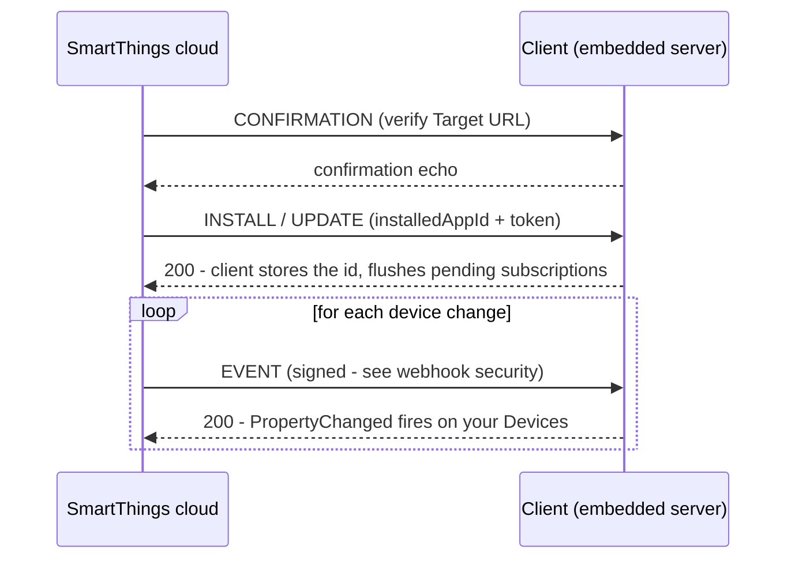

[📚 Documentation](README.md) › **Live updates**

# Live updates

Two mechanisms keep your `Device` objects in sync with the real world. Both
feed the **same** `PropertyChanged` events — your reactive code never knows (or
cares) which one is active:

| | 📡 Polling | ⚡ Push (webhook events) |
|---|---|---|
| Auth required | PAT **or** OAuth | OAuth-In App only — a PAT cannot subscribe |
| How it works | `Client` re-fetches device status in the background | SmartThings POSTs events to your webhook |
| Latency | Up to one polling interval (default 10 s) | Sub-second |
| Needs a public URL | No | Yes (tunnel is fine) |
| Default when | `Client(token)` | `Client(oauthConfig, …)` |

- [Polling](#polling)
- [Push](#push)
- [The ngrok walkthrough](#the-ngrok-walkthrough)
- [The webhook lifecycle](#the-webhook-lifecycle)
- [Subscription escape hatches](#subscription-escape-hatches)
- [Rate limits](#rate-limits)
- [Threading](#threading)

---

## Polling

A PAT gives you no push, so the `Client` makes polling invisible instead: **by
default it automatically polls every device it hands out**, on a background
thread, starting at construction. There is no poller object to create or start.

```cpp
Client client(token);                      // PollingMode::Automatic - already polling
auto devices = client.getDevices();        // each device auto-registered for polling

auto* sensor = devices.front()->getCapability<standard::ContactSensor>();
auto sub = sensor->PropertyChanged.SubscribeScoped(
    [](ObservableObject&, PropertyChangedArgs args) {
        std::cout << "changed: " << args.PropertyName() << "\n";
    });

client.setPollingInterval(std::chrono::seconds(10));   // optional tuning
```

What you get for free:

- **Change-only notifications.** The reactive property system fires
  `PropertyChanged` only when a value *actually* changes, so an idle device is
  silent even though it is being polled.
- **Deduplication.** Fetching the same device id twice (repeated
  `getDevice()` calls) still costs one status request per cycle; the result is
  applied to every live `Device` object for that id.
- **Automatic cleanup.** A destroyed `Device` silently drops out of polling —
  nothing to unregister.

### Manual mode

Opt out of the background thread and drive updates on your own schedule:

```cpp
Client client(token, PollingMode::Manual);
// ... your own timer/loop:
client.pollNow();          // one synchronous poll cycle, on your thread
```

The full control surface:

| Method | Purpose |
|---|---|
| `pollNow()` | One synchronous cycle (any mode, any thread) |
| `setPollingInterval(ms)` / `getPollingInterval()` | Tune the cycle delay (clamped to ≥ 5 s) |
| `startPolling()` / `stopPolling()` / `isPolling()` | Start/stop the background thread at will |
| `registerDevice(device)` | Include a hand-constructed `Device` in polling |

---

## Push

With an OAuth-mode `Client`, SmartThings *pushes* device events to a webhook —
and the client handles the entire pipeline autonomously:

- its **embedded HTTP server** receives the webhook POSTs (and the OAuth
  redirect — one server, two routes);
- every inbound request is **cryptographically verified** first
  ([details](webhook-security.md));
- **subscriptions are managed for you**: each `Device` the client hands out is
  subscribed to on creation (re-using a previous run's subscription when
  possible, since subscription writes are rate-limited) and unsubscribed when
  its last `shared_ptr` dies;
- each event is dispatched onto the live `Device` objects through the *same*
  reactive path polling uses — one `PropertyChanged` subscription covers both
  worlds.

No polling runs in OAuth mode (though `startPolling()` remains available as a
manual opt-in). The consuming code is identical to the polling case:

```cpp
Client client(config, 9753, "/oauth/callback", "/webhook",
              "https://your-domain.ngrok-free.dev", "./st4cpp-data");

client.openBrowserRequested += [](std::string url) {
    std::cout << "Open to authorize:\n" << url << "\n";
};
client.authenticate();
client.waitForAuthentication(std::chrono::minutes(5));

auto devices = client.getDevices();        // each device auto-subscribed
auto sub = devices.front()->PropertyChanged.SubscribeScoped(
    [](ObservableObject&, PropertyChangedArgs args) {
        std::cout << "pushed: " << args.PropertyName() << "\n";
    });
```

The only thing the cloud needs from you is a **public HTTPS URL** that reaches
the embedded server. That's what the walkthrough below sets up.

---

## The ngrok walkthrough

From zero to real pushed events, step by step. You'll do steps 1–4 **once**;
after that it's just "start the tunnel, start the app".

### 1. Get a stable public URL

Install [ngrok](https://ngrok.com/download) (the free plan is enough) and claim
your free **static domain** in the ngrok dashboard — with a static domain you
never have to re-register URLs when the tunnel restarts:

```bash
ngrok http --url=your-domain.ngrok-free.dev 9753
```

This forwards `https://your-domain.ngrok-free.dev` → `http://127.0.0.1:9753`.
TLS terminates at ngrok; the embedded server listens in plain HTTP on
`127.0.0.1` only, which satisfies SmartThings' valid-HTTPS-certificate
requirement without you touching a certificate.

### 2. Create the OAuth-In App

Follow [Authentication — Step 1](authentication.md#step-1--register-your-oauth-in-app)
(`smartthings apps:create`, via the CLI). When prompted:

- **Redirect URI:** `https://your-domain.ngrok-free.dev/oauth/callback`
- **Target URL** (where events are POSTed): `https://your-domain.ngrok-free.dev/webhook`

The paths must match the `oauthCallbackRoute` / `webhookCallbackRoute` you pass
to the `Client` constructor. Use `smartthings apps:update` /
`smartthings apps:oauth:update` to change them later.

### 3. Write the code

```cpp
#include <smartthings4cpp/smartthings4cpp.h>
#include <iostream>
#include <thread>

using namespace smartthings4cpp;

int main() {
    oauth2::OAuth2Config config;
    config.clientId     = std::getenv("SMARTTHINGS_CLIENT_ID");
    config.clientSecret = std::getenv("SMARTTHINGS_CLIENT_SECRET");

    Client client(config, 9753, "/oauth/callback", "/webhook",
                  "https://your-domain.ngrok-free.dev",   // your static domain
                  "./st4cpp-data");

    client.openBrowserRequested += [](std::string url) {
        std::cout << "Open this URL to authorize:\n  " << url << "\n";
    };

    client.authenticate();
    if (auto r = client.waitForAuthentication(std::chrono::minutes(5)); !r) {
        std::cerr << "auth failed: " << r.error_message << "\n";
        return 1;
    }

    auto devices = client.getDevices();               // auto-subscribed to push
    std::vector<ScopedSubscription> subs;
    for (auto& device : devices) {
        subs.push_back(device->PropertyChanged.SubscribeScoped(
            [](ObservableObject& sender, PropertyChangedArgs args) {
                auto& cap = static_cast<Capability&>(sender);
                std::cout << "[push] " << cap.capabilityId()
                          << "." << args.PropertyName() << " changed\n";
            }));
    }

    std::this_thread::sleep_for(std::chrono::minutes(10));   // ...or your app's loop
}
```

### 4. First run

1. Start the tunnel (`ngrok http --url=... 9753`), then run your program.
2. It prints the authorize URL → open it, sign in, consent. The redirect lands
   on the embedded server through the tunnel; authentication completes by
   itself. SmartThings then verifies the Target URL with a `CONFIRMATION`
   handshake and installs the app — all answered automatically.
3. The token is persisted (Windows Credential Manager / file). **Later runs
   authenticate silently** — no browser.

### 5. Watch it work

Toggle a device in the SmartThings mobile app. Within a second your handler
prints the change — pushed, not polled. The
[`event_updates` example](examples.md#event_updates) is this exact program,
ready to run.

> [!TIP]
> The ngrok web interface at <http://127.0.0.1:4040> shows every request
> hitting your tunnel — invaluable when [events don't arrive](troubleshooting.md#no-events-arrive).

---

## The webhook lifecycle

For the curious (you never handle these yourself): SmartThings drives a
webhook app through phases, all answered by `Client::handleWebhook()`:



The `INSTALL`/`UPDATE` phase is where the client learns its **installed-app
id** — the key the Subscriptions API is scoped to. It is persisted, so
subsequent runs can adopt the previous run's subscriptions instead of
re-creating them.

---

## Subscription escape hatches

Normal consumers never touch subscriptions — they're automatic. For
narrower-than-default control, the protocol surface is public:

```cpp
SubscriptionRequest req;
req.deviceId = "device-uuid";
req.stateChangeOnly = true;                       // default: only real changes
Result<Subscription> s = client.subscribeTo(req);

client.listSubscriptions();                       // what's registered right now
client.deleteSubscription(s.value->id);
client.deleteAllSubscriptions();
client.subscribeToAllDevices();                   // what automatic mode does
```

Similarly, `handleWebhook()` is public so an app that receives the POST through
its [own HTTP stack](extending.md#ihttpserver) can forward it manually.

---

## Rate limits

The SmartThings cloud enforces per-resource limits the library is designed
around, but that you can still hit with aggressive manual use:

| Limit | Library behavior |
|---|---|
| **12 status reads/min per device** | `setPollingInterval()` clamps to ≥ 5 s; each unique device is fetched once per cycle no matter how many `Device` objects exist |
| **Subscription writes are rate-limited** | Automatic subscriptions are created once, adopted across runs, and retried on 429 |

If you drive `pollNow()` or `subscribeTo()` yourself in a tight loop, expect
`ErrorCode::RateLimited` and back off.

---

## Threading

`PropertyChanged` fires on **whichever thread delivered the update**:

- polling mode → the background polling thread (or *your* thread for a manual
  `pollNow()`);
- OAuth mode → the embedded server's thread.

Attribute storage is not synchronized against concurrent access. If your
handler touches state shared with other threads — or anything thread-affine
like a GUI — synchronize or marshal it yourself. Keep handlers quick; they run
inline with the update pipeline.

---

<div align="center">

[← Devices & capabilities](device-model.md) · **Next:** [Webhook security →](webhook-security.md)

</div>
